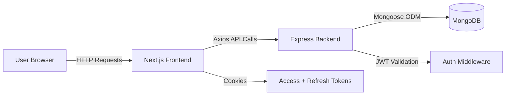
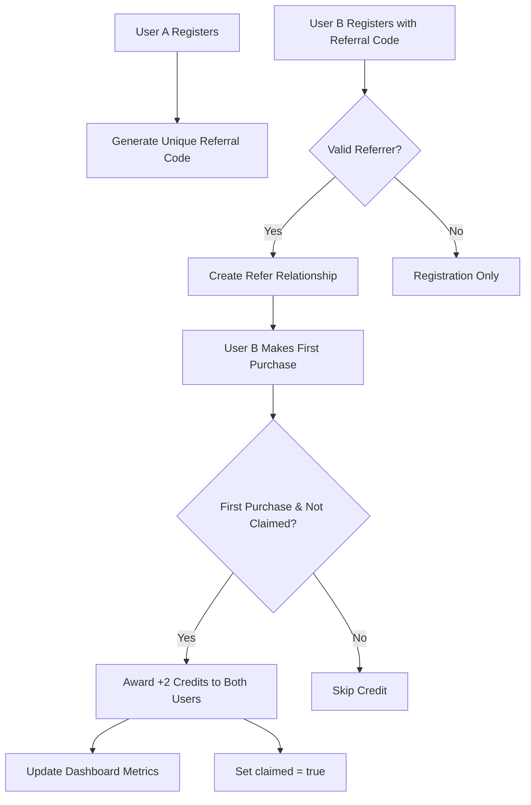

# 📘 ReferMe – Referral & Credit System

## 🚀 Project Overview
**ReferMe** is a full-stack referral and credit system that allows users to sign up, share referral links, and earn credits when their referred friends make their first purchase.  
Built to demonstrate clean architecture, scalable backend logic, and modern, minimal UI design.

### 🧠 Tech Stack
- **Frontend:** Next.js 14 + TypeScript + Tailwind CSS + Framer Motion  
- **Backend:** Node.js + Express.js + MongoDB (Mongoose)  
- **State Management:** Context API (AuthProvider)  
- **Authentication:** JWT (Access + Refresh Tokens via Cookies)  
- **API Client:** Axios  

## 🏗️ Architecture

### High-Level System Design



### Referral Flow Diagram



### Layered Architecture

| Layer | Technology | Purpose |
|-------|-----------|---------|
| **Presentation** | Next.js + React | UI Components, Pages, Context |
| **API Layer** | Express REST API | Route Handling, Controllers |
| **Business Logic** | Controllers + Utils | Referral Logic, Credit System |
| **Data Access** | Mongoose Models | Database Queries |
| **Database** | MongoDB | Data Persistence |

---

## 📡 API Documentation

### 🔐  Routes

| Method | Endpoint | Description | Auth Required |
|--------|----------|-------------|---------------|
| `POST` | `/api/v1/users/sign-up` | Create new user account with refer (if provided) | ❌ |
| `POST` | `/api/v1/users/login` | Login with email & password | ❌ |
| `GET` | `/api/v1/users/logout` | Logout and clear cookies | ✅ |
| `GET` | `/api/v1/users/profile` | Fetch logged-in user details | ✅ |
| `GET` | `/api/v1/users/buy-product` | Simulating product purchase and grant +2 credits to both users if applicable | ✅ |

---

## 🗄️ Database Models

### User Model

```javascript
{
  name: String,
  email: String (unique, required),
  password: String (hashed),
  referCode: String (unique),
  credits: Number (default: 0),
  referCount: Number (default: 0),
  converted: Number (default: 0),
  referredUsers: [ObjectId],
  createdAt: Date,
  updatedAt: Date
}
```

### Refer Model

```javascript
{
  referal_sender: ObjectId (ref: 'User'),
  referal_receiver: ObjectId (ref: 'User'),
  claimed: Boolean (default: false),
  createdAt: Date
}
```

---

## 📁 Project Structure

### Client (Next.js)

```
client/
├── app/
│   ├── (public)/
│   │   ├── login/
│   │   │   └── page.tsx
│   │   └── signup/
│   │       └── page.tsx
│   ├── (protected)/
│   │   └── dashboard/
│   │       └── page.tsx
│   ├── layout.tsx
│   └── page.tsx
├── components/
│   ├── dashboard/
│   │   ├── MetricCard.tsx
│   │   └── PurchaseCard.tsx
│   │   ├── RefersTable.tsx
│   │   └── ReferralLinkCard.tsx
│   │──── Input.tsx
│   │──── Button.tsx
│   └──── AuthCard.tsx
├── context/
│   └── authContext.tsx
├── helper/
│   └── axiosInstance.ts
├── middleware.ts
└── styles/
    └── globals.css
```

### Server (Express)

```
server/
├── src/
│   ├── controllers/
│   │   ├── authController.ts
│   ├── routes/
│   │   ├── userRoutes.ts
│   ├── middlewares/
│   │   ├── authMiddleware.ts
│   │   └── errorHandler.ts
│   ├── models/
│   │   ├── user.model.ts
│   │   └── refer.model.ts
│   ├── utils/
│   │   ├── generateToken.ts
│   │   └── generateReferralCode.ts
│   │   ├── ApiError.ts
│   │   └── ApiResponse.ts
│   ├── dataBase/
│   │   └── DBConnection.ts
│   └── index.ts
├── .env
└── package.json
```

---

## 🚀 Installation

### Prerequisites

- Node.js >= 18.x
- MongoDB (local or Atlas)
- npm or yarn

### Clone Repository

```bash
git clone https://github.com/Sanjaygehlot1/ReferMe.git
```

### Install Dependencies

```bash
# Install server dependencies
cd server
npm install

# Install client dependencies
cd ../client
npm install
```

---

## 🔑 Environment Variables

### Server (.env)

Create a `.env` file in the `server/` directory:

```env
# Server Configuration
PORT=8000
MONGO_URI=mongodb+srv://<username>:<password>@cluster.mongodb.net/FileSure
ACCESSTOKEN_SECRET=yourAccessSecretKey
REFRESHTOKEN_SECRET=yourRefreshSecretKey
ACCESSTOKEN_EXPIRY=15m
REFRESHTOKEN_EXPIRY=7d
CORS_ORIGIN=http://localhost:3000
```

### Client (.env.local)

Create a `.env.local` file in the `client/` directory:

```env
NEXT_PUBLIC_API_BASE=http://localhost:8000/api/v1
NEXT_PUBLIC_APP_URL=http://localhost:3000
```

---

## 💻 Usage

### Start Development Servers

```bash
# Terminal 1 - Start Backend
cd server
npm run dev

# Terminal 2 - Start Frontend
cd client
npm run dev
```

### Access Application

- **Frontend**: http://localhost:3000
- **Backend API**: http://localhost:8000

### Test Referral Flow

1. **Register User A** → Receive referral code
2. **Register User B** with User A's referral code
3. **User B makes first purchase** → Both users get +2 credits
4. **Check Dashboard** → View metrics and referred users

---

## 🧪 Testing

### Using Postman


1. Import collection:   [](https://god.gw.postman.com/run-collection/37444944-7d41f406-92f9-4522-98dd-779d9f59d0f0?action=collection%2Ffork&source=rip_markdown&collection-url=entityId%3D37444944-7d41f406-92f9-4522-98dd-779d9f59d0f0%26entityType%3Dcollection%26workspaceId%3D8e63f96b-5d57-487e-908e-bbb96b744a14)
2. Set environment variable(if not set) `{{baseUrl}}` = `http://localhost:8000/api/v1`
3. Run authentication flow first to get JWT tokens
4. Test referral and purchase endpoints

<div align="center">

**Made with ❤️ by Sanjay Gehlot**

⭐ Star this repo if you found it helpful!

</div>
